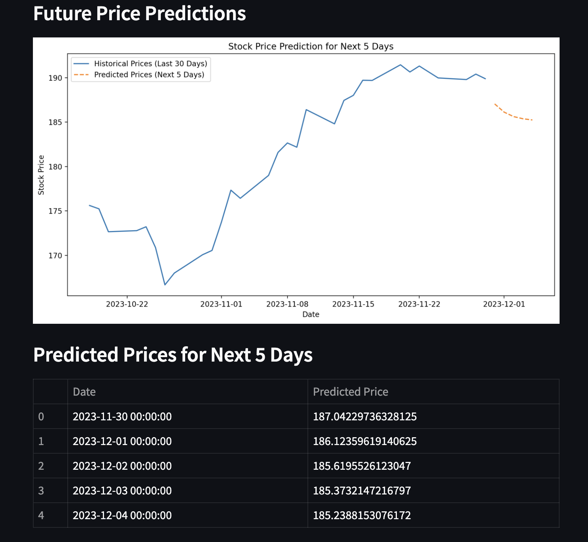

# Stock Price Prediction

This project aims to predict stock prices using machine learning algorithms. The goal is to provide accurate predictions based on historical data.

## Table of Contents
- [Introduction](#introduction)
- [Installation](#installation)
- [Usage](#usage)
- [Running the Streamlit App](#running-the-streamlit-app)
- [Contributing](#contributing)
- [License](#license)

## Introduction
Stock price prediction is a challenging task that involves analyzing historical data to forecast future prices. This project utilizes various machine learning techniques to achieve this goal.

## Installation
To get started with the project, follow these steps:

1. Clone the repository:
    ```sh
    git clone https://github.com/yourusername/stock_price_prediction.git
    ```
2. Navigate to the project directory:
    ```sh
    cd stock_price_prediction
    ```
3. Install the required dependencies:
    ```sh
    pip install -r requirements.txt
    ```

## Usage
To use the project, follow these steps:

1. Prepare your dataset and place it in the `data` directory.
2. Run the analysis notebook:
    ```sh
    jupyter notebook analysis.ipynb
    ```

## Running the Streamlit App
To run the Streamlit app, follow these steps:

1. Ensure you have Streamlit installed (it is included in the requirements).
2. Run the Streamlit app:
    ```sh
    streamlit run app.py
    ```

## Contributing
Contributions are welcome! Please read the [contributing guidelines](CONTRIBUTING.md) before submitting a pull request.

## License
This project is licensed under the MIT License. See the [LICENSE](LICENSE) file for details.


